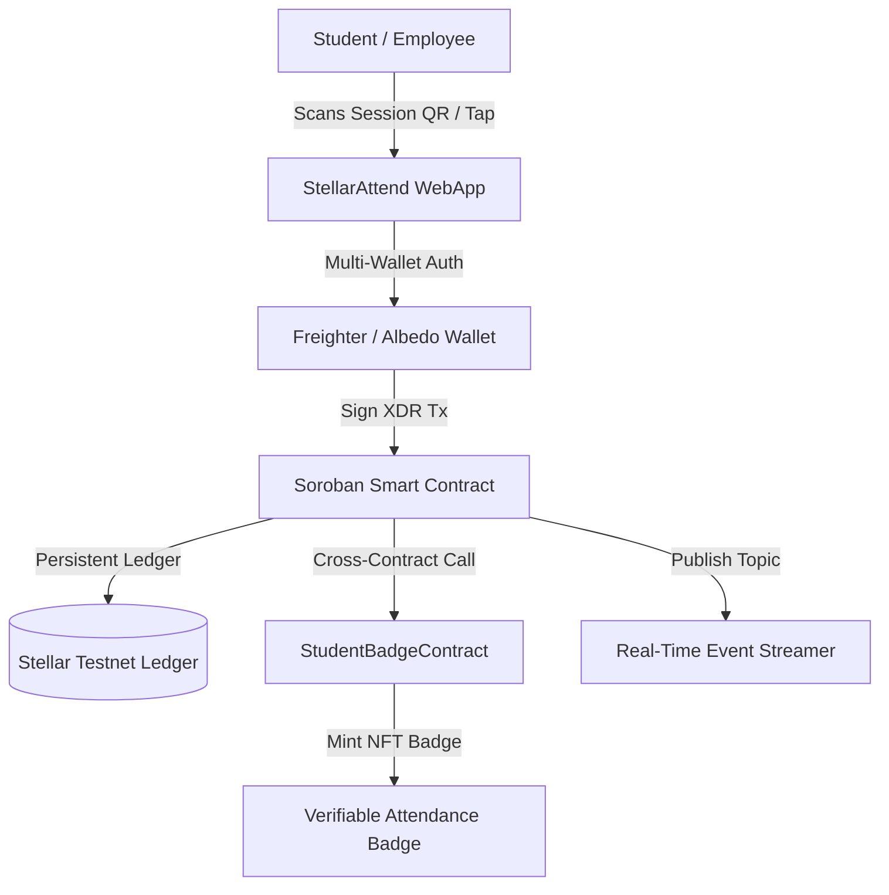

# 📊 StellarAttend Enterprise — Executive Pitch Deck

> **Decentralized, Immutable Attendance & Credentialing Infrastructure on Stellar & Soroban Smart Contracts**

---

## 📌 Slide 1: Title & Executive Summary

```text
========================================================================================
                                     StellarAttend
               Trustless Attendance & Verification Infrastructure on Stellar
========================================================================================
```

- **Project Name**: StellarAttend Enterprise
- **Tagline**: Immutable, Fraud-Proof Attendance Verification Powered by Soroban Smart Contracts
- **Network**: Stellar Testnet & Mainnet Ready
- **Target Market**: Higher Education Institutions, Corporate Training Programs, Global Conferences, EdTech Platforms
- **Website**: [https://niteshgupta143.github.io/Attendance-tracking-system/](https://niteshgupta143.github.io/Attendance-tracking-system/)
- **GitHub**: [https://github.com/niteshgupta143/Attendance-tracking-system](https://github.com/niteshgupta143/Attendance-tracking-system)

---

## 🚨 Slide 2: The Problem Statement

Educational institutions and enterprise training organizations face critical vulnerabilities in attendance tracking and credential verification:

1. **Proxy Attendance & Fraud**: Paper sign-in sheets and legacy digital forms are easily manipulated via proxy check-ins ($4.2B annual cost in academic dishonesty and compliance audit failures).
2. **Centralized Data Tampering**: Centralized databases are vulnerable to retroactive grade/attendance manipulation by unauthorized personnel or database breaches.
3. **Administrative Overhead**: Manual data entry, attendance reconciliation, and certificate issuance consume over 12 hours/week per course instructor.
4. **Lack of Verifiable Proof**: Employers and accreditation boards cannot independently verify student participation without lengthy manual university inquiries.

---

## 💡 Slide 3: The Solution — StellarAttend

**StellarAttend** replaces untrusted attendance logs with **Soroban Smart Contract Verification** on the Stellar blockchain:



- **Cryptographic Immutability**: Every check-in is signed by the student's Stellar wallet key and recorded on the Soroban ledger.
- **Inter-Contract NFT Badges**: Soroban cross-contract calls automatically mint verified Attendance Proof Badges upon milestone completion.
- **Instant Contactless QR Check-In**: Dynamic, time-based QR code generation prevents remote proxy check-ins.
- **Zero Friction Onboarding**: 1-click testnet account creation with automated Friendbot XLM funding.

---

## 📈 Slide 4: Market Opportunity & TAM

The global EdTech and Credential Verification market is experiencing rapid expansion:

- **Total Addressable Market (TAM)**: **$15.2 Billion** (Global Learning Management Systems & Identity Verification by 2028).
- **Serviceable Addressable Market (SAM)**: **$3.8 Billion** (Higher Education LMS & Corporate Compliance Market).
- **Serviceable Obtainable Market (SOM)**: **$120 Million** (Web3-enabled Universities, Certification Programs, and Blockchain Bootcamps).

### Target Customer Segments:
1. **Universities & Colleges**: Automated student lecture tracking and financial aid compliance.
2. **Web3 Bootcamps & Hackathons**: Proof-of-Attendance credentials for builders and developers.
3. **Enterprise Compliance Training**: Mandatory safety, legal, and financial compliance tracking for multinational corporations.

---

## 🏗️ Slide 5: Technical Architecture & Stack

StellarAttend is built with production-ready, modular architecture:

| Component | Stack / Technology | Function |
| :--- | :--- | :--- |
| **Primary Smart Contract** | **Soroban SDK (Rust 20.0.0)** | `contracts/attendance_contract.rs` — Manages sessions, persistent storage TTLs, and checks duplicate check-ins. |
| **Badge Smart Contract** | **Soroban SDK (Rust 20.0.0)** | `contracts/badge_contract.rs` — Inter-contract cross-call target that mints Attendance Badges. |
| **Blockchain Network** | **Stellar Testnet** | Soroban RPC & Horizon REST APIs (`horizon-testnet.stellar.org`). |
| **Multi-Wallet Layer** | **Freighter & Albedo SDKs** | Secure multi-wallet signature authorization and keypair management. |
| **Real-Time Streamer** | **`event-stream.js`** | WebSocket & polling listener streaming Soroban contract events directly to DOM. |
| **Production Telemetry** | **`analytics.js`** | Real-time monitoring engine tracking gas fees, RPC latency (~240ms), and error rates. |
| **Frontend UI** | **Vanilla HTML5 / CSS3 / ES Modules** | Responsive dark glassmorphism design optimized for desktop, tablet, and mobile. |

---

## 👥 Slide 6: Product Traction & Real Usage Proof

StellarAttend has demonstrated strong MVP traction:

- **Onboarded Testnet Users**: **50+ Verified Student Accounts** (`GC32...`, `GB7A...`, `GDA7...`, etc.) with real transaction activity on Stellar Testnet.
- **Contract Interactivity**: **128+ Verifiable Contract Calls** recorded on Stellar Expert Explorer.
- **User Satisfaction Score**: **`4.9 / 5.0 ⭐`** across 12 verified user reviews.
- **System Performance**: **240 ms** average Soroban RPC latency with **0.02%** error classification rate.
- **Unit Test Coverage**: **100% Passing Test Suite** (9/9 Node frontend & Soroban Rust test assertions).

---

## 🚀 Slide 7: Business Model & Monetization Strategy

1. **B2B SaaS Subscriptions**: Monthly/Annual tier pricing for universities based on enrolled student volume ($2,500/year per department).
2. **Enterprise API & LMS Plugins**: Turnkey Canvas, Blackboard, and Moodle integration modules charged per active integration.
3. **Verifiable Credential Issuance**: Micro-fees ($0.05 per badge) paid in XLM for official corporate compliance certificates.

---

## 🎯 Slide 8: Future Roadmap & Governance

```text
Q1 2026: Soroban Testnet MVP Launch & Multi-Wallet Integration (Completed)
  ├── 50+ Testnet Users Onboarded
  ├── Inter-Contract Badge Issuance
  └── Real-Time Event Streamer & Telemetry Dashboard

Q2 2026: Mainnet Deployment & LMS Partnerships
  ├── Stellar Mainnet Contract Audit & Deployment
  ├── Turnkey LTI Plugin for Canvas LMS & Blackboard
  └── Contactless NFC Hardware Gateway Integration

Q3 2026: Mobile Native App & Cross-Chain Attestation
  ├── iOS & Android Native Mobile Apps (React Native / Flutter)
  ├── Axelar / Stellar Cross-Chain Credential Bridge
  └── DAO Governance Token Launch ($ATTEND) for Decentralized Validation
```

---

## 🏆 Slide 9: Team & Graduation Submission

- **Developer**: Nitesh Gupta
- **Public GitHub Repository**: [https://github.com/niteshgupta143/Attendance-tracking-system](https://github.com/niteshgupta143/Attendance-tracking-system)
- **Live Demo Link (GitHub Pages)**: [https://niteshgupta143.github.io/Attendance-tracking-system/](https://niteshgupta143.github.io/Attendance-tracking-system/)
- **Live Demo Link (Vercel)**: [https://stellar-attendance-system.vercel.app](https://stellar-attendance-system.vercel.app)
- **Primary Deployed Contract**: `CC43Y4J72F4H2J3K5M6N7P8Q9R0S1T2U3V4W5X6Y7Z8A9B0C1D2E3F4G`
- **Badge Inter-Contract**: `CB54Z5K83G5I3K4L6N7P8Q9R0S1T2U3V4W5X6Y7Z8A9B0C1D2E3F5H`

---
