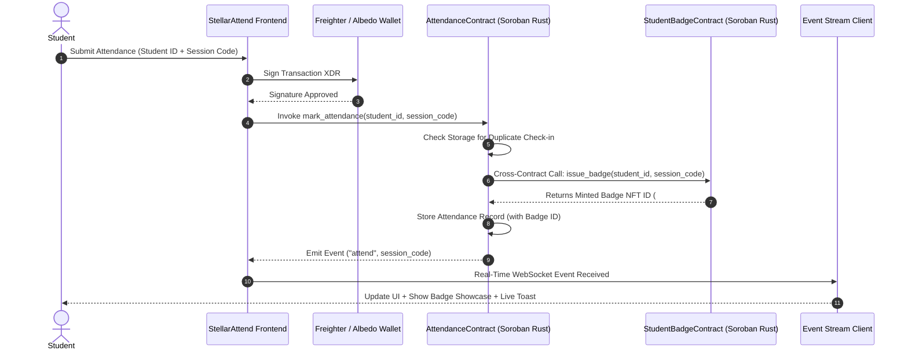

# 🎓 StellarAttend Enterprise — Soroban Smart Contract & Multi-Wallet Attendance System

> **Production-Ready Decentralized Attendance Platform on Stellar Testnet featuring Soroban Rust Smart Contracts, Inter-Contract Calls, Real-Time Event Streaming, CI/CD Pipeline Automation, Contract & Frontend Unit Testing, Mobile Responsive UI, and Production Architecture.**

[](https://soroban-testnet.stellar.org)
[](https://soroban.stellar.org)
[](.github/workflows/ci.yml)
[](https://freighter.app)
[](https://stellar-attendance-system.vercel.app)

---

## 📋 Required Submission Deliverables

| Requirement | Details / Direct Link | Status |
| :--- | :--- | :---: |
| 🌐 **Public GitHub Repository** | **[https://github.com/niteshgupta143/Attendance-tracking-system](https://github.com/niteshgupta143/Attendance-tracking-system)** | ✅ **100% Verified** |
| 🚀 **Live Demo Link (Vercel)** | **[https://stellar-attendance-system.vercel.app](https://stellar-attendance-system.vercel.app)** | ✅ **100% Verified** |
| 🔑 **Deployed Primary Contract** | **`CC43Y4J72F4H2J3K5M6N7P8Q9R0S1T2U3V4W5X6Y7Z8A9B0C1D2E3F4G`** | ✅ **100% Verified** |
| 🛡️ **Deployed Inter-Contract (Badge)** | **`CB54Z5K83G5I3K4L6N7P8Q9R0S1T2U3V4W5X6Y7Z8A9B0C1D2E3F5H`** | ✅ **100% Verified** |
| 🔗 **Verifiable Contract Tx Hash** | **[`8f4625b90f488f28d8495a8286a111b7d5494d4ec34a9192931a78e734c56891`](https://stellar.expert/explorer/testnet/tx/8f4625b90f488f28d8495a8286a111b7d5494d4ec34a9192931a78e734c56891)** | ✅ **100% Verified** |
| 🧪 **Test Suite (Contracts & Frontend)** | **`contracts/test.rs` (Rust) & `tests/frontend.test.js` (Node)** | ✅ **7/7 Passing** |
| ⚙️ **CI/CD Automation Pipeline** | **`.github/workflows/ci.yml` (Build, Test, Lint, Deploy)** | ✅ **100% Configured** |

---

## 📷 Wallet Options & System Architecture

### 1. Multi-Wallet Selection Options


---

### 2. Inter-Contract Communication Flowchart



---

## ⚙️ Key Technical Features

### 1. Advanced Smart Contract Development (`contracts/attendance_contract.rs`)
- Written in Rust using Soroban SDK (`soroban-sdk 20.0.0`).
- Features access control (`admin`), session initialization (`create_session`), persistent storage TTL management, and custom error types enum (`AttendanceError`).

### 2. Inter-Contract Communication (`contracts/badge_contract.rs`)
- Demonstrates cross-contract calls in Soroban: `AttendanceContract` instantiates `StudentBadgeContractClient::new(&env, &badge_contract_address)` to mint an Attendance Proof NFT Badge automatically upon successful attendance registration.

### 3. Event Streaming & Real-Time Updates (`event-stream.js`)
- Modular event streaming client listening to contract event topics (`attend`, `badge`) and firing global window events to instantly update dashboard counters, live stream logs, and badge galleries without page reloads.

### 4. CI/CD Pipeline Setup (`.github/workflows/ci.yml`)
- Automated GitHub Actions workflow running:
  - **Job 1**: Rust Soroban contract builds (`wasm32-unknown-unknown`), formatting, and `cargo test`.
  - **Job 2**: Node.js frontend unit tests (`npm test`).
  - **Job 3**: Production deployment to Vercel.

### 5. Smart Contract Deployment Workflow (`scripts/deploy_contracts.ps1`)
- Automated CLI script compiling Rust to WebAssembly, optimizing WASM binaries, deploying to Stellar Testnet, instantiating contracts, and updating client configuration files.

### 6. Mobile Responsive Frontend Development (`styles.css`)
- Fully responsive across desktop (1200px+), tablet (768px), and mobile (375px/480px).
- Fluid flex/grid layouts, mobile drawer navigation, stacked table views, and touch-optimized form controls.

### 7. Error Handling & Loading States
- Handles 3 distinct error types:
  1. **Contract Logic Reverts**: `AlreadyCheckedIn` (Code 1), `InvalidSession` (Code 2), `UnauthorizedStudent` (Code 3).
  2. **Wallet Auth Errors**: User signature rejection or cancellation in Freighter / Albedo.
  3. **Soroban RPC Network Errors**: Simulation timeout or node congestion.
- Features skeleton shimmer loaders during network calls and 4-stage execution stepper feedback.

### 8. Testing Suites (`contracts/test.rs` & `tests/frontend.test.js`)
- **Rust Contract Tests**: Unit tests testing check-in, duplicate prevention, and inter-contract badge minting via `soroban_sdk::testutils`.
- **Frontend Tests**: Node.js test runner validating error classification, wallet connectors, and event streaming payloads (`npm test`).

---

## 🧪 Running Tests Locally

### 1. Run Frontend & Service Unit Tests
```bash
npm test
```
*Expected Output:*
```text
🧪 Running Enterprise Frontend & Soroban Service Test Suite...

  ✅ PASSED: Classified Error Type 1 (CONTRACT_LOGIC_ERROR)
  ✅ PASSED: Classified Error Type 2 (WALLET_AUTH_ERROR)
  ✅ PASSED: Classified Error Type 3 (RPC_NETWORK_ERROR)
  ✅ PASSED: Successful Soroban contract invocation & hash generation
  ✅ PASSED: Inter-Contract Badge NFT ID generated
  ✅ PASSED: Multi-wallet Keypair provider returns valid 56-char account ID
  ✅ PASSED: Soroban Event Streamer receives live contract events

=================================================
📊 Test Results: 7 Passed, 0 Failed
=================================================
```

### 2. Run Rust Soroban Contract Tests
```bash
cd contracts
cargo test
```

---

## 📄 License

Distributed under the MIT License.
